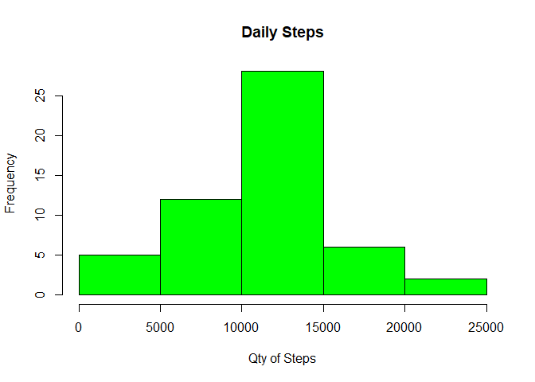
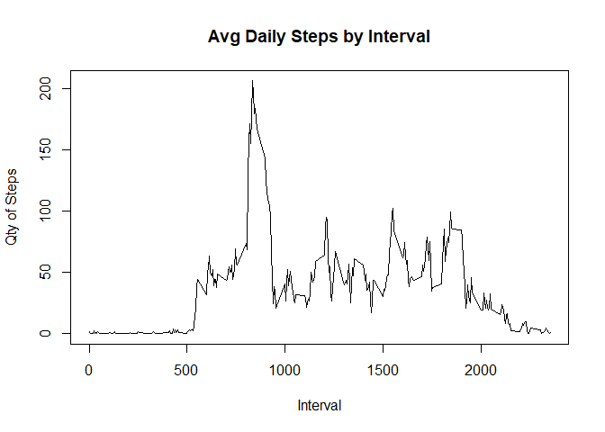
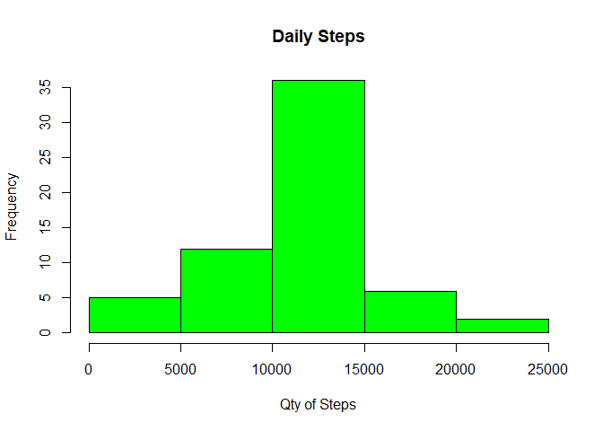
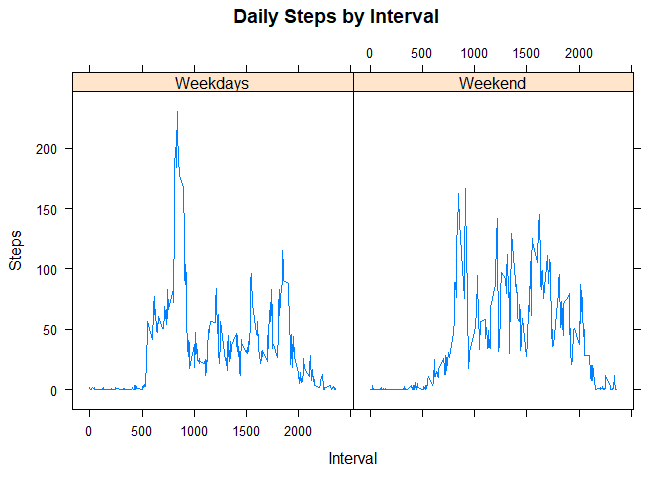

Assignment Details
------------------

It is now possible to collect a large amount of data about personal
movement using activity monitoring devices such as a Fitbit, Nike
Fuelband, or Jawbone Up. These type of devices are part of the
"quantified self" movement - a group of enthusiasts who take
measurements about themselves regularly to improve their health, to find
patterns in their behavior, or because they are tech geeks. But these
data remain under-utilized both because the raw data are hard to obtain
and there is a lack of statistical methods and software for processing
and interpreting the data.

This assignment makes use of data from a personal activity monitoring
device. This device collects data at 5 minute intervals through out the
day. The data consists of two months of data from an anonymous
individual collected during the months of October and November, 2012 and
include the number of steps taken in 5 minute intervals each day.

Data
----

The data for this assignment can be downloaded from the course web site:

-   <https://d396qusza40orc.cloudfront.net/repdata%2Fdata%2Factivity.zip>

The variables included in this dataset are:

\*steps: Number of steps taking in a 5-minute interval (missing values
are coded as NA)

\*date: The date on which the measurement was taken in YYYY-MM-DD format

\*interval: Identifier for the 5-minute interval in which measurement
was taken

The dataset is stored in a comma-separated-value (CSV) file and there
are a total of 17,568 observations in this dataset.

Reading in the dataset
----------------------

Download and load to 'activity'

      download.file("https://d396qusza40orc.cloudfront.net/repdata%2Fdata%2Factivity.zip","Repr-Rsch-Proj1-activity.zip")
      unzip("Repr-Rsch-Proj1-activity.zip")
      activity <- read.table("activity.csv", header=TRUE, sep=",", stringsAsFactors=FALSE, dec=".")

What is mean total number of steps taken per day?
-------------------------------------------------

Objective - Histogram of the total number of steps taken each day

Objective - Mean and median number of steps taken each day

    dailysteps <- aggregate(steps ~ date, activity, sum)
    hist(dailysteps$steps, main = paste("Daily Steps"), col="green", xlab="Qty of Steps")

    dailysteps_median <- median(dailysteps$steps)
    dailysteps_mean <- mean(dailysteps$steps)

Median = 10765

Mean = 1.076618910^{4}

What is the average daily activity pattern?
-------------------------------------------

Objective - Time series plot of the average number of steps taken

Objective - The 5-minute interval that, on average, contains the maximum
number of steps

    intervalsteps <- aggregate(steps ~ interval, activity, mean)

    plot(intervalsteps$interval,intervalsteps$steps, type="l", xlab="Interval", ylab="Qty of Steps",main="Avg Daily Steps by Interval")

    interval_max <- intervalsteps[which.max(intervalsteps$steps),1]

Interval with max number of steps = 835

Impute missing values.
----------------------

Objective - Code to describe and show a strategy for imputing missing
data

Objective - Histogram of the total number of steps taken each day after
missing values are imputed

Calculate and report the total number of missing values in the dataset
(i.e. the total number of rows with NAs)

Devise a strategy for filling in all of the missing values in the
dataset. The strategy does not need to be sophisticated. For example,
you could use the mean/median for that day, or the mean for that
5-minute interval, etc.

Create a new dataset that is equal to the original dataset but with the
missing data filled in.

    missingvalues <- sum(is.na(activity$steps))

    reviseddata <- transform(activity, steps = ifelse(is.na(activity$steps), intervalsteps$steps[match(activity$interval, intervalsteps$interval)], activity$steps))

Make a histogram of the total number of steps taken each day and
Calculate and report the mean and median total number of steps taken per
day. Do these values differ from the estimates from the first part of
the assignment? What is the impact of imputing missing data on the
estimates of the total daily number of steps?

    dailysteps_revised <- aggregate(steps ~ date, reviseddata, sum)
    hist(dailysteps_revised$steps, main = paste("Daily Steps"), col="green", xlab="Qty of Steps")

New calculations for revised data

    dailysteps_mean_revised <- mean(dailysteps_revised$steps)
    dailysteps_median_revised <- median(dailysteps_revised$steps)
    meanimpact <- dailysteps_mean_revised - dailysteps_mean
    medimpact <- dailysteps_median_revised - dailysteps_median
    totalimpact <- sum(dailysteps_revised$steps) - sum(dailysteps$steps)

-   Revised data mean = 1.076618910^{4} and the difference from original
    is 0

-   Revised data median = 1.076618910^{4} and the difference from
    original is 1.1886792

-   Total difference from original and revised is 8.612950910^{4}

Are there differences in activity patterns between weekdays and weekends?
-------------------------------------------------------------------------

Create a new factor variable in the dataset with two levels - "weekday"
and "weekend" indicating whether a given date is a weekday or weekend
day.

Make a panel plot containing a time series plot (i.e. type ="l") of the
5-minute interval (x-axis) and the average number of steps taken,
averaged across all weekday days or weekend days (y-axis). See the
README file in the GitHub repository to see an example of what this plot
should look like using simulated data.

    weekend <- c("Saturday", "Sunday")

    reviseddata$day = as.factor(ifelse(is.element(weekdays(as.Date(reviseddata$date)),weekend), "Weekend", "Weekdays"))

    intervalsteps_revised <- aggregate(steps ~ interval + day, reviseddata, mean)

    library(lattice)

    with(intervalsteps_revised, xyplot(steps ~ interval|day, main="Daily Steps by Interval",xlab="Interval", ylab="Steps", type="l"))

